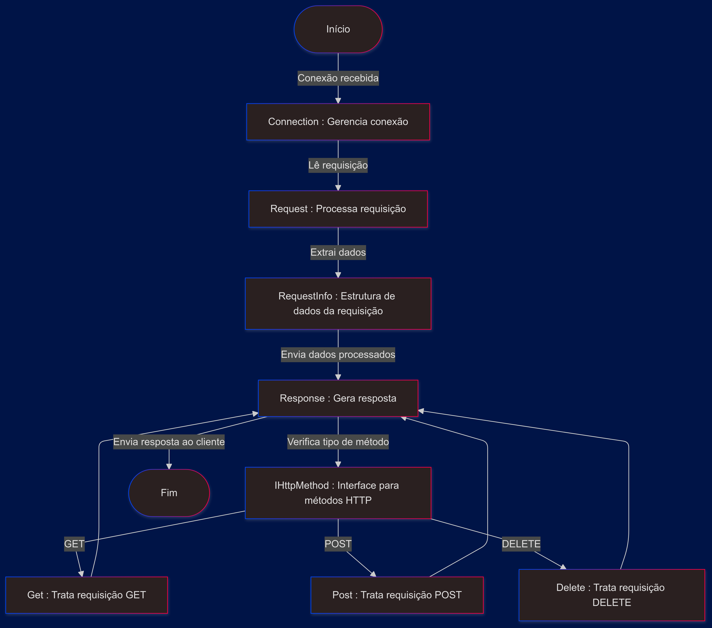
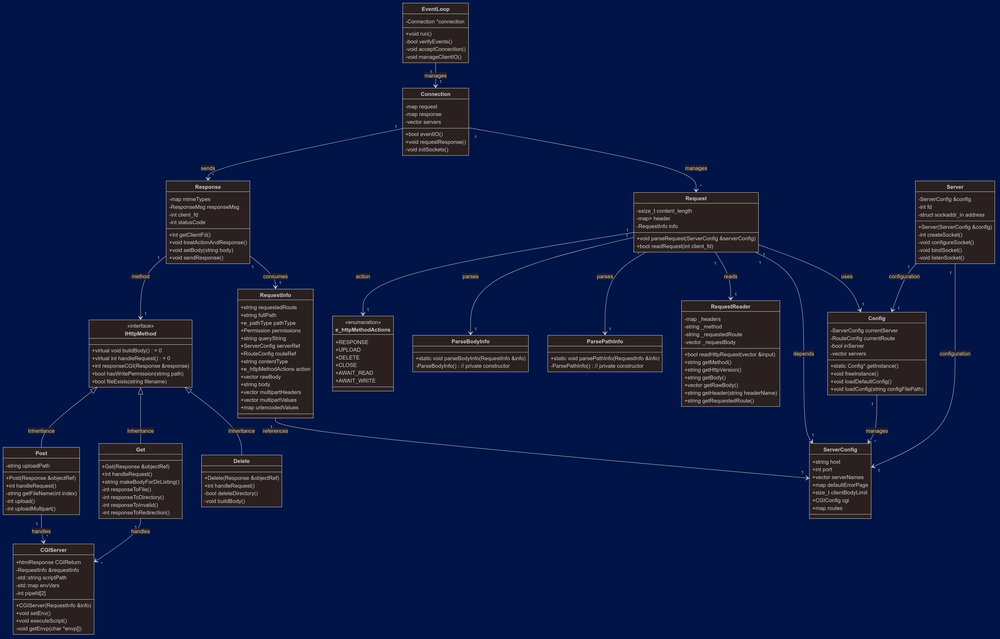

# WebServ

**WebServ** é um servidor web escrito em C++, inspirado no funcionamento do Nginx. Este projeto tem como objetivo desenvolver um servidor HTTP básico capaz de interpretar requisições HTTP e retornar respostas adequadas. 

## Funcionalidades

- Suporte a CGI.
- Manipulação de múltiplas conexões.
- Configuração de rotas e métodos HTTP.
- Configuração de limites de corpo do cliente e redirecionamentos.

## Estrutura do Projeto

- **src/**: Contém os arquivos-fonte principais (`.cpp`) do servidor.
- **includes/**: Contém os arquivos de cabeçalho (`.hpp`) usados no projeto.
- **cgi-bin/**: Diretório onde os scripts CGI são armazenados.
- **serverRoot/**: Diretório raiz default usado pelo servidor para servir arquivos.
- **logs/**: Diretório para armazenar os logs gerados pelo servidor.
- **config.conf**: Arquivo de configuração do servidor.
- **Makefile**: Arquivo para compilar, limpar e rodar o projeto.
- **test/**: Contém testes automatizados para validação das funcionalidades do servidor.

## Compilação e Execução

### Requisitos

Certifique-se de ter o compilador `c++` (compatível com `-std=c++98`) e `valgrind` (opcional) instalados.

### Comandos Principais

1. **Compilar o Projeto**
    ```bash
    make
    ```

2. **Executar o Servidor**
    ```bash
    make run
    ```

## Configuração

O arquivo `config.conf` permite definir os parâmetros do servidor, como porta, diretório raiz, e métodos aceitos. Ajuste este arquivo conforme suas necessidades antes de iniciar o servidor.

## Arquitetura do projeto

Veja o fluxo geral do programa.



Veja o diagrama de classes para uma visão geral da arquitetura do projeto.



## Estrutura de Logs

Os logs são armazenados no diretório `logs/` e podem ser resetados com o comando `make resetLogs`.

## Licença

Este projeto é distribuído sob a licença MIT.


